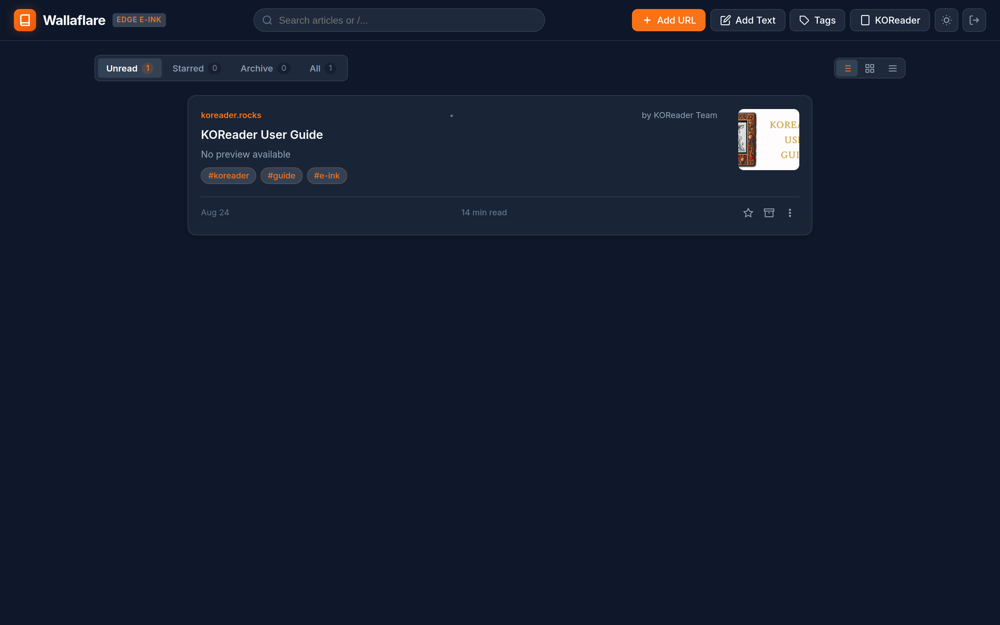
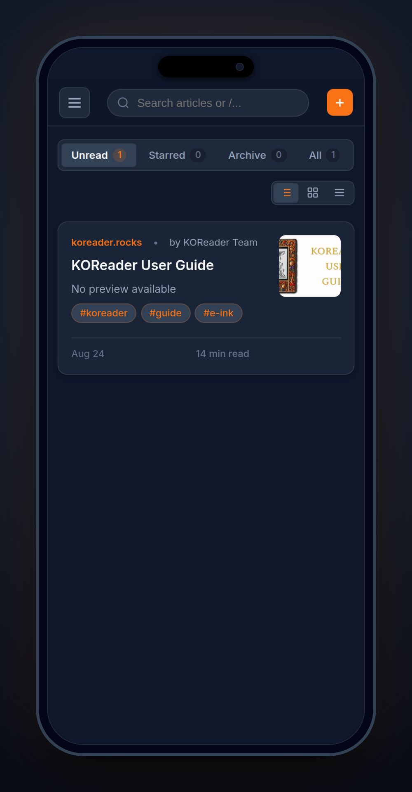

# 📖 Wallaflare

> **Ultra-lightweight, zero-cost, serverless Read-it-Later & Wallabag v2 API replacement.**  
> Built for Cloudflare Workers, Cloudflare D1 (Serverless SQLite), and E-ink readers (KOReader, Kindle, Kobo, Android).

[](https://opensource.org/licenses/MIT)
[](https://workers.cloudflare.com/)
[](https://developers.cloudflare.com/d1/)
[](https://wallabag.org/)
[](https://koreader.rocks/)

<p align="center">
  
</p>
<p align="center">
  
</p>

---

## ✨ Features

- **🚀 100% Serverless & Free Tier Friendly**: Runs entirely on Cloudflare Workers with SQLite (D1). Sub-millisecond cold starts across 300+ global edge locations.
- **📱 Drop-in Wallabag v2 API Compatibility**:
  - Full compatibility with the **Official Wallabag Android App** (connection test, OAuth token authentication, article fetching, incremental sync with `since`, and two-way deletion).
  - Compatible with **KOReader's Wallabag plugin** for automated article sync and offline reading on Kindle, Kobo, Boox, and Android e-ink devices.
  - Wallabag browser extensions and third-party clients work out of the box.
- **🎛️ 3 Distinct Library View Layouts**:
  - **☰ List View (Default)**: Modern horizontal card layout with 1:1 square right-aligned thumbnails, Instapaper-style `xx of yy min left` reading time, and dedicated author row.
  - **⊞ Magazine Grid**: Visually immersive grid layout with hero top image covers.
  - **☷ Compact Headlines**: Dense 1-row table layout on desktop, intelligently transforming into 2 rows on mobile portrait to prevent headline truncation.
- **🏷️ Full Tag Management & Batch Operations**:
  - Categorize articles with tags (`#tech`, `#news`, `#novel`, `#litrpg`).
  - **Instant 0ms Tag Caching**: Zero-delay tag badge rendering backed by synchronous local storage and offline DB derivation.
  - **Batch Tagging & Partial Tags**: Select multiple articles to apply common or new tags, with distinct indicators for partially applied tags.
  - **Global Tag Manager**: View all tags with live article counts, delete unused/orphaned tags in 1 click, and safely untag articles with confirmation.
  - Full Wallabag v2 Tag API compatibility (`/api/tags`, `/api/entries/:id/tags`, `/api/entries.json?tags=...`).
- **🌐 Comprehensive RTL & Hebrew / Arabic Support**:
  - Automatic language and Unicode script detection for Right-to-Left (RTL) articles (Hebrew, Arabic, Persian, Urdu, Yiddish).
  - Web reader and card titles automatically align right with RTL blockquotes and typography.
  - EPUB generator sets `page-progression-direction="rtl"`, Hebrew metadata labels, and semantic figures so KOReader renders RTL books natively.
- **📱 Native Android App (Capacitor & Native Bridge)**:
  - **Ultra-Lightweight Release**: Only **1.2 MB** with R8 ProGuard optimization.
  - **Instant Local Cache**: 0.0ms instantaneous startup rendering from offline storage with automatic background server revalidation.
  - **Floating Share Dialog & Duplicate Alerts**: Share links from Chrome, Twitter, Reddit, or any app — opens a lightweight floating card with duplicate detection (`ℹ Article Already in Library` + original save date) and direct `[Read Article]` / `[Open App]` action buttons.
  - **Native Status Bar & Notch Shield**: Integrated `@capacitor/status-bar` sync with theme-matched safe-area punch-hole shields so text never collides with front cameras.
  - **Native EPUB Export & Share Sheet**: Export articles directly to Android's system share sheet to open in KOReader, Moon+ Reader, ReadEra, save to Downloads, or send to Kindle.
  - **Edge-to-Edge Design & Gestures**: Dynamic safe-area padding, pull-to-refresh with real-time physics, glassmorphic in-app confirmation modals, and double-back-to-exit protection.
- **📚 Rich Multi-Page EPUB Generator**:
  - Automatically generates clean EPUB 3 / EPUB 2 files formatted to match Wallabag.
  - Bundles high-resolution preview cover images (`cover.xhtml` + `cover.png/jpg`) and downloads all inline article photos.
  - Cleans convoluted CMS wrappers into standard semantic HTML5 figures (`<figure><figcaption>`) for reliable rendering on KOReader (Crengine) and Kindle.
  - Generates Wallabag-style summary/metadata pages (Author, Published Date, Estimated Reading Time, Added Date, Source Link).
- **🖥️ Responsive Web Dashboard & Distraction-Free Reader**:
  - **Mobile Auto-Hide Header**: Reader header and status bar slide up smoothly (500ms delay) as you read, and seamlessly restore on slow upward scrolling (~3 lines).
  - **Expandable Sidebar Dock**: Desktop sidebar that smoothly expands on hover with clear labels (`← Back`, `⭐ Favorite`, `📦 Archive`, `🏷️ Tags`, `📥 EPUB`, `🔄 Re-fetch`, `Aa Font`, `🌓 Theme`).
  - **Responsive Sub-URLs**: `/read/:id`, `/starred`, `/archive` with native browser Back/Forward navigation.
  - **Reading Progress Bar**: Live scroll progress indicator with Instapaper-style remaining time calculation.
  - **Themes & Typography**: Dark, Light, and Sepia modes with Serif / Sans-serif toggles and fine-tuned font sizing.
- **🔍 Smart Article Ingestion & Resilient Re-Fetching**:
  - Powered by `@mozilla/readability` and `linkedom` for fast serverless content extraction with relative URL canonicalization and lead image resolution.
  - **Resilient Re-Fetching**: Updates article text and cover images from live sources while preserving existing covers if newly scraped pages omit them.
- **🕵️ Complete Search Engine & Crawler Exclusion**:
  - Automatically emits `X-Robots-Tag: noindex, nofollow, noarchive, nosnippet` HTTP headers on every response.
  - Serves `/robots.txt` disallowing all web crawlers and injects `<meta name="robots">` into all pages to keep your personal reading list 100% private.
- **🛡️ Two-Tier Content Sanitization & XSS Defense**:
  - **Server-Side Linkedom Sanitizer**: Purges dangerous tags (`<script>`, `<iframe>`, `<object>`, `<embed>`, `<form>`), strips inline event handlers (`onload`, `onerror`, `onclick`), and neutralizes `javascript:` URIs before content is stored in D1.
  - **Client-Side DOMPurify Pass**: Articles rendered in the web reader pass through DOMPurify for defense-in-depth XSS protection.
  - **Strict Content Security Policy (CSP)**: Global HTTP headers restrict script execution and completely disallow plugin/object embedding (`object-src 'none'`).
- **🛡️ Built-in Brute-Force & Rate-Limiting Protection**:
  - Native IP-based lockout protection across all Web & API authentication routes (`/oauth/v2/token`, `/api/auth/verify`, and protected `/api/*` endpoints).
  - Enforces a **5-attempt threshold** before triggering a **15-minute lockout** (`HTTP 429 Too Many Requests`).
  - **Live Lockout Countdown**: The web UI displays real-time countdown feedback with automatic field re-enabling upon expiration.
  - **Timing-Safe Comparison**: Constant-time string comparison (`crypto.subtle.timingSafeEqual`) protects against secret extraction via side-channel timing attacks.

---

## 🛠️ Quick Start & Deployment

### Prerequisites
- Node.js 18+
- A free [Cloudflare Account](https://dash.cloudflare.com/sign-up)

### 1. Clone & Install
```bash
git clone https://github.com/UserCel/wallaflare.git
cd wallaflare
npm install
```

### 2. Create Cloudflare D1 Database
Run the following command to create your serverless SQLite database on Cloudflare:
```bash
npx wrangler d1 create wallaflare-db
```
Wrangler will output your unique `database_id`:
```toml
[[d1_databases]]
binding = "DB"
database_name = "wallaflare-db"
database_id = "xxxxxxxx-xxxx-xxxx-xxxx-xxxxxxxxxxxx"
```

### 3. Configure `wrangler.toml`
If starting from scratch, copy the example config:
```bash
cp wrangler.toml.example wrangler.toml
```
Open `wrangler.toml` and update:
1. `database_id`: Paste the ID from Step 2 into `database_id = "..."`.
2. *(Optional)* `routes`: If using a custom domain (e.g. `wallaflare.yourdomain.com`), configure it under `routes`. Otherwise, comment it out to use your free `*.workers.dev` subdomain.

### 4. Initialize Database Schema
Run the database migrations on Cloudflare D1:
```bash
npm run db:migrate:remote
```

### 5. Set Access Token Secret (Recommended)
Set your secure master access token/password in Cloudflare's encrypted secrets:
```bash
npx wrangler secret put AUTH_TOKEN
```
*(When prompted, type your chosen password/token).*

### 6. Deploy to Cloudflare Workers
Deploy your serverless instance to the Cloudflare edge:
```bash
npm run deploy
```
Your instance is now live worldwide! 🎉

---

### 📱 Native Android App Build (Capacitor)
Wallaflare includes a first-class native Android wrapper with background share integration and native EPUB export.

1. **Build Debug APK**:
   ```bash
   npm run build:apk
   ```
   Output: `android/app/build/outputs/apk/debug/app-debug.apk`

2. **Build Minimized Release APK (1.2 MB)**:
   ```bash
   npm run build:apk:release
   ```
   Output: `android/app/build/outputs/apk/release/app-release.apk`

---

### 📸 Promotional Screenshot Generator
Generate high-resolution desktop and smartphone mockups in seconds with:
```bash
npm run screenshot
```
Output saved to `assets/screenshots/`.

---

## 📱 Client Setup Guide

### KOReader (Kindle / Kobo / Android / Linux)
1. Open **KOReader**.
2. Navigate to **Search / Tools > Wallabag**.
3. Configure the settings:
   - **Server URL**: `https://your-domain.workers.dev` (or your custom domain)
   - **Username / Client ID**: `wallaflare`
   - **Password / Client Secret**: Your `AUTH_TOKEN` (or any string if authentication is disabled)
4. Tap **Sync now** — KOReader will sync and download EPUBs with covers and metadata!

### Official Wallabag Android App
1. Open the **Wallabag Android App**.
2. Choose **Wallabag v2**.
3. Enter your Server URL (`https://your-domain.workers.dev`).
4. Enter `wallaflare` as Username and your `AUTH_TOKEN` as Password.
5. Tap **Test connection** and connect!

---

## 🔒 Security & Architecture

- **Stateless & Edge-Native**: No servers to manage, no Docker containers, no background database daemons.
- **Zero Hardcoded Secrets**: Secrets and tokens are managed via Cloudflare Secrets (`wrangler secret put AUTH_TOKEN`).
- **Two-Tier Content Sanitization & Defense-in-Depth**:
  - Server-side linkedom DOM parser cleans executable tags, inline event attributes, and dangerous URI protocols before saving to database.
  - Client-side reader uses DOMPurify before innerHTML injection.
  - Strict Content-Security-Policy (CSP) headers block unauthorized script sources and object/embed plugins.
- **Native Rate-Limiting & Brute-Force Defense**:
  - Automatically tracks consecutive failed password/token attempts per client IP in Cloudflare D1.
  - Returns explicit attempt counts on failures and strictly locks out aggressive brute-force attempts for 15 minutes after 5 failures.
  - Constant-time cryptographic comparison (`crypto.subtle.timingSafeEqual`) protects against token timing attacks.
- **Search Engine & Crawler Disallow**: Built-in `X-Robots-Tag` headers, `/robots.txt`, and HTML meta tags prevent public indexing of private libraries.
- **Authorization Header Support**: All web actions and EPUB downloads pass credentials securely in HTTP `Authorization: Bearer <token>` headers rather than exposing tokens in query URLs.

---

## 🤖 Development Note

Wallaflare was designed and developed through human-directed, LLM-assisted pair programming. Community contributions, pull requests, and bug reports are warmly welcome!

## 📄 License

This project is licensed under the [MIT License](LICENSE) — matching the Wallabag project license.
