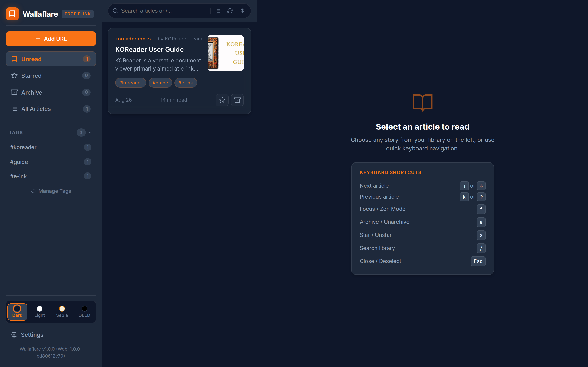
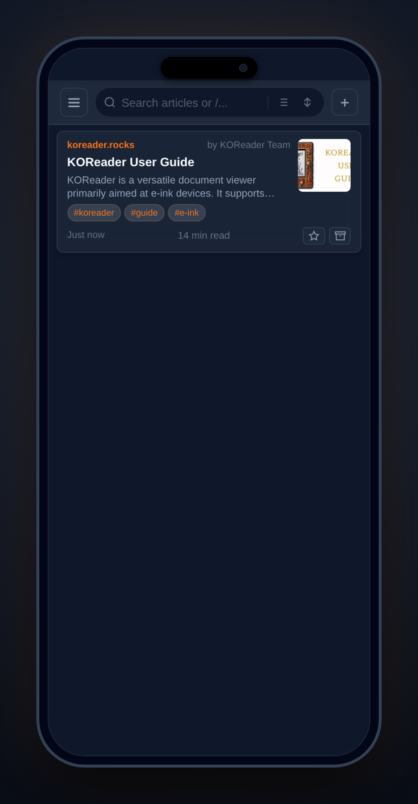

<div align="center">

# 📖 Wallaflare

**Ultra-lightweight, zero-cost, serverless Read-it-Later & Wallabag v2 API engine for Cloudflare Workers & D1.**

[](LICENSE)
[](https://workers.cloudflare.com/)
[](https://developers.cloudflare.com/d1/)
[](https://doc.wallabag.org/en/developer/api/index.html)
[](https://koreader.rocks/)

<p align="center">
  
</p>
<p align="center">
  
</p>

</div>

---

## ✨ Features

- **⚡ Serverless Edge Architecture**: Runs entirely on Cloudflare Workers and Cloudflare D1 (SQLite) with sub-millisecond cold starts and generous free-tier limits.
- **📱 Universal Wallabag v2 API**: 100% compatible with **KOReader** (E-ink Kindle/Kobo), the official **Wallabag Android App**, and **Wallabagger** browser extensions.
- **🖥️ Isomorphic 3-Pane Dashboard**:
  - Desktop 3-pane workspace with live search, 5 sort modes, and 3 view densities (List, Magazine Grid, Compact).
  - 1:1 touch swipe drawer and bottom action bars on mobile.
  - 4 themes: **Dark**, **Light**, **Sepia**, and **OLED Black**.
- **🔄 Revision-Based Delta Sync & Offline Outbox**:
  - Monotonic revision tracking transfers only modified articles and deletion tombstones (`deleted_ids`).
  - Durable offline outbox (`IndexedDB`) records mutations offline and syncs sequentially upon reconnection.
- **🍪 Authenticated Scraping & Session Cookie Vault**:
  - Native in-app WebView login and cookie sync for paywalled / login-required sites (Substack, Medium, GitHub, private repos).
  - Server-side D1 cookie vault and on-device scraping with deterministic re-injection.
- **🖍️ Multi-Color Annotations & W3C Highlights**:
  - Resilient W3C text position/quote selectors across theme and font size changes.
  - 4-color palette (`🟡`, `🟢`, `🔵`, `🟣`), attached notes, in-memory batching, and Markdown export with highlights (`==text==`) and footnotes (`[^note]`).
- **📡 RSS 2.0 & Atom Feed Syndication**:
  - Full-text RSS feeds with sanitized `<content:encoded>` HTML for **NetNewsWire**, **Reeder**, **Feeder**, **Feedly**, **NewsFlash**, and RSS aggregators.
  - Dedicated endpoints for Unread (`/feed/unread`), Starred (`/feed/starred`), Archive (`/feed/archive`), All (`/feed/all`), and Tags (`/feed/tags/:tag`).
  - Compatible with Wallabag v2 single-user legacy feed paths (`/feed/:user/:token/unread`).
  - Strict read-only credential isolation via `READ_TOKEN` with IP-based brute-force rate-limiting.
- **📚 OPDS 1.2 Book Catalog & Acquisition Feeds**:
  - Full OPDS 1.2 Atom XML catalog compatibility for **KOReader**, **Crosspoint**, **Moon+ Reader**, **Librera**, **Foliate**, and e-ink e-readers.
  - Dedicated feeds for Unread, Starred, All, Archive, and Tags, with OpenSearch 1.1 in-app catalog search.
  - Dynamic, on-the-fly EPUB 3 downloads with embedded cover art and metadata.
  - Supports HTTP Basic Auth (`wallaflare` / `AUTH_TOKEN` or `READ_TOKEN`), Bearer headers, and pre-authenticated direct URLs (`?token=...`) with recursive child link token propagation.
  - Optional read-only `READ_TOKEN` secret to isolate e-reader and RSS feed credentials from administrative controls.
- **📦 On-Device Multi-Format Exports**:
  - Client-side **EPUB 3** (with cover art and metadata), **GitHub-flavored Markdown** (with YAML frontmatter), and **PDF** generation without third-party services.
  - Bulk ZIP exports for multiple selected articles.
- **🛡️ Two-Tier Security & Privacy**:
  - Server-side Linkedom DOM sanitizer strips unsafe scripts, styles, and trackers.
  - Built-in brute-force rate-limiting and crawler disallow headers.

---

## 🛠️ Quick Start & Deployment

### Prerequisites
- Node.js 18+
- A free [Cloudflare Account](https://dash.cloudflare.com/sign-up)

### 1. Clone & Install
```bash
git clone https://github.com/UserCel/wallaflare.git
cd wallaflare
npm install
```

### 2. Create Cloudflare D1 Database
```bash
npx wrangler d1 create wallaflare-db
```
Copy the generated `database_id` into your `wrangler.toml`:
```toml
[[d1_databases]]
binding = "DB"
database_name = "wallaflare-db"
database_id = "xxxxxxxx-xxxx-xxxx-xxxx-xxxxxxxxxxxx"
```

### 3. Initialize Database Schema
```bash
npm run db:migrate:remote
```

### 4. Set Master Access Password
```bash
npx wrangler secret put AUTH_TOKEN
```

*(Optional)* Set a dedicated read-only token for OPDS e-readers and RSS readers (KOReader, Feeder, NetNewsWire):
```bash
npx wrangler secret put READ_TOKEN
```

### 5. Deploy
```bash
npm run deploy
```
Your instance is now live worldwide! 🎉

---

## 📱 Client Setup Guide

### 📖 OPDS 1.2 Book Catalog (KOReader, Crosspoint, Moon+ Reader)
Wallaflare serves a native **OPDS 1.2 Book Catalog** for instant browsing and downloading articles directly as formatted EPUBs:

- **Standard Catalog URL**:
  ```
  https://<your-subdomain>.workers.dev/opds
  ```
  - **KOReader**: Go to **Tools > OPDS catalog > Add new catalog**, enter the catalog URL, and sign in with:
    - **Username**: `wallaflare`
    - **Password**: Your `READ_TOKEN` (if configured) or master `AUTH_TOKEN`
    *(Note: If a dedicated `READ_TOKEN` is set, only `READ_TOKEN` is accepted on `/opds` for strict security isolation).*
  - **In-Catalog Search**: Full support for OpenSearch 1.1 search queries (`/opds/search?q=...`) inside KOReader and OPDS apps.

- **Pre-Authenticated Direct URL (Crosspoint / Embedded E-readers)**:
  ```
  https://<your-subdomain>.workers.dev/opds?token=YOUR_TOKEN
  ```
  *(Automatically propagates `?token=...` across all catalog categories and EPUB acquisition links so embedded readers download in 1 click without separate authentication dialogs).*

---

### 📡 RSS 2.0 & Atom Feeds (Feeder, NetNewsWire, Reeder, Feedly)
Wallaflare serves real-time RSS 2.0 feeds with full article HTML bodies:

- **Available Feed Endpoints**:
  | Feed Type | URL |
  | :--- | :--- |
  | **Unread Queue** | `https://<your-subdomain>.workers.dev/feed/unread?token=READ_TOKEN` |
  | **Starred Articles** | `https://<your-subdomain>.workers.dev/feed/starred?token=READ_TOKEN` |
  | **Archive** | `https://<your-subdomain>.workers.dev/feed/archive?token=READ_TOKEN` |
  | **All Articles** | `https://<your-subdomain>.workers.dev/feed/all?token=READ_TOKEN` |
  | **Tagged Articles** | `https://<your-subdomain>.workers.dev/feed/tags/<tag>?token=READ_TOKEN` |

- **HTTP Basic Auth Mode (No Token in URL)**:
  If your RSS reader supports HTTP Basic Auth (e.g. NetNewsWire, Reeder, Feeder):
  - **Feed URL**: `https://<your-subdomain>.workers.dev/feed/unread`
  - **Username**: `wallaflare`
  - **Password**: Your `READ_TOKEN` (or master `AUTH_TOKEN`)

---

### 📚 KOReader Wallabag 2-Way Sync
1. In KOReader, go to **Tools > Wallabag > Settings > Configure Wallabag server**.
2. Enter the parameters:
   - **Server URL**: `https://<your-subdomain>.workers.dev` (or your custom domain)
   - **Client ID**: `wallaflare`
   - **Client Secret**: `wallaflare`
   - **Username**: `wallaflare`
   - **Password**: Your `AUTH_TOKEN`
3. Tap **Sync now** in **Tools > Wallabag** — KOReader will sync and download clean EPUBs with covers and reading progress.

### 📱 Official Wallabag Android App
1. Open the Wallabag App.
2. Enter your Server URL (`https://<your-subdomain>.workers.dev`).
3. Enter `wallaflare` as Username and your `AUTH_TOKEN` as Password.
4. Tap **Test connection** and connect.

### 🌐 Wallabagger (Browser Extension)
1. Open **Wallabagger Settings**.
2. Enter your instance URL (`https://<your-subdomain>.workers.dev`).
3. Click **Check URL / Connect** and sign in with your `AUTH_TOKEN`.

---

## 📦 Native Android App (Capacitor & OTA Updates)

Wallaflare includes a native Android app wrapper with system share sheet integration, native file sharing, and automatic Over-The-Air (OTA) web bundle updates:

- **Build Debug APK**:
  ```bash
  npm run build:apk
  ```
- **Build Release APK**:
  ```bash
  npm run build:apk:release
  ```
- **Deploy Web & Push OTA Update**:
  ```bash
  npm run deploy
  ```

---

## 📄 License

This project is licensed under the [MIT License](LICENSE).
